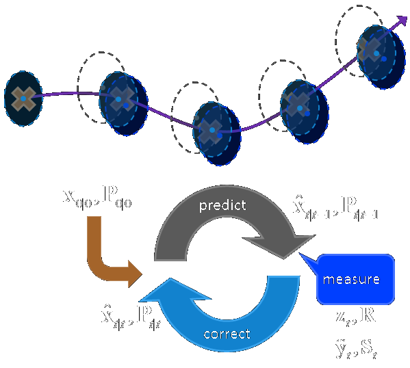

<!-- class: center, middle -->
# Interlignes
####Installation vidéo participative
#### La Sophiste
 
Thomas Girault thomas@girault.fr
 
Mitch Fournial mitch@lasophiste.com
   
http://www.lasophiste.com/portfolio/interlignes/
 
https://github.com/thomasgirault/interlignes

---

<!-- class: center, middle -->
<!--  -->

<!-- http://bredechas2017.blogspot.com/2017/04/170428-lml-georges-perec-ses-vies-mode.html -->
<!-- class: left, middle  -->
<!-- background-size: cover -->

---
<video controls style='position: absolute;left: -60px;  top: 0px;'>
  <source src="img_interlignes/Interlignes.mp4" type="video/mp4">
</video>
---

## Tentative d'épuisement d'un lieu parisien (1975)
En octobre 1974, Georges Perec s'installe place Saint-Sulpice (Paris 6ième) 

Pendant trois jours d'affilée, il tente de prendre note de tout ce qu'il voit
.center[

]

Il en établit ainsi une liste représentant la vie quotidienne, sa monotonie, mais aussi les variations infimes du temps, de la lumière, du décor, du vivant.

---

<i>
Esquisse d'un inventaire de quelques-unes des choses strictement visibles : 
 ...
 
 — Des slogans fugitifs : « De l' autobus , je regarde Paris » 
 — De la terre : du gravier tassé et du sable. 
 — De la pierre : la bordure des trottoirs, une fontaine , une église , des maisons... 
 — De l'asphalte 
 — Des arbres ( feuilles, souvent jaunissants ) 
 — Un morceau assez grand de ciel (peut-être 1/6e de mon champ visuel) 
 — Une nuée de pigeons qui s'abat soudain sur le terre-plein central, entre l'église et la fontaine 
 — Des véhicules (leur inventaire reste à faire) 
 — Des êtres humains 
 — Une espèce de basset 
 — Un pain (baguette) 
 — Une salade (frisée ?) débordant partiellement d'un cabas 
 
 Trajectoires: 
 Le 96 va à la gare Montparnasse 
 Le 84 va à la porte de Champerret 
 Le 70 va Place du Dr Hayem , Maison de 
 l'O.R.T.F. 
 Le 86 va à Saint-Germain-desPrés 
 Exigez le Roquefort Société le vrai dans son ovale vert 
 ...
</i>

---
# Projet artistique
la rue libère le texte de sa page
- mise en mots de l'environement que nous traversons et qui nous traverse
- mise en espace des mots que porte l'environement
- la marche comme écriture (Oulipo)

la lecture fabrique une expérience sociale 
- le texte est mis en lumière par nos trajectoires
- sa lecture développe une interaction sociale

---
# 2017 : débuts du projet
- mai : écriture d'un dossier de candidature pour Nuit Blanche Paris 2017
- fin juin : projet retenu !
- septembre : 
  - développement logiciel (10j)
  - contruction de la structure métalique (5j)
  - premiers tests et ajustements (3j)
- 7 octobre - diffusion aux Archives Nationales - 5000 spectateurs  

---
## Mise en oeuvre technique
- déploiement physique : capteur infrarouge et vidéo-projecteur
- analyse vidéo : extraction d'objets pour le suivi de mouvements
- expérience spectateur : rendu du texte et projection mapping

.center[

]
--- 

<!-- dispositif vidéo déployé dans un espace urbain -->
<!-- - caméra infrarouge  - vidéo-projecteur (5000 lumens) -->

---
class:center, middle

# Déploiement du dispositif physique

---
class: split-40 
## Conditions pour jouer en public

.column[
conditions nocturnes

zone de jeu rectangulaire
- ~20 personnes peuvent interagir simultanément 
- ~100 personnes peuvent circuler autour de la zone

dispositif placé en hauteur
- H=8m => image = 12x8m
]

---

---
## Structure métalique autoportée (v1)
.column[

]

.right[
        
- soudée sur mesure
- poids = 30kg, lestage = 120kg
- temps de montage : 2h
]

---
class: split-40
## Simplification du dispositf (v2)
.column[
  
]
.column[
   
- projecteur posé a plat 
- miroir à 45° devant l'objectif
- structure placée derrière une fenêtre
- amélioration de la sécurité
- simplification du déploiement
]

---
class:center, middle

# Dispositifs et outils de captation

---
### Captation v1 : Kinect + Libfreenect2
- kernel density estimation : captation à 15m au lieu de 5m :)
- détection simultanée et complémentaire des flux 3d et IR
.center[

]
limitations
- bruit généré par le capteur
- conditions atmosphériques (pluie)
- USB3 : rallonge 5m max

<!-- - résolution (640 x 480) -->
<!--  -->

[Efficient Multi-Frequency Phase Unwrapping using Kernel Density Estimation (Järemo Lawin et al. 2016)](https://arxiv.org/abs/1608.05209)

---
class: split-40
<!-- - caméra vidéosurveillance wifi : Rapberry-PI + module caméra infrarouge -->
### Captation v2 : Raspberry caméra IR + projecteur IR
.column[

]
.column[
  
- image de meilleure qualité
- projection IR ciblée sur la scène
- WiFi ou ethernet
- filtre lumière visible : flux parasites et texte

hauteur plus importante (> 15m) 
- surface d'interaction étendue
- déport caméra facultatif
]

---
class:center, middle
# Analyse vidéo en temps réél
### détection du public
### suivi des mouvements
---
class: split-40
# Détection et suivi du public : architecture
.column[

]
.column[
    
prétraitements
  - background substraction
  - détection de formes

 

tracking d'objets multiples
  * analyse prédictive du déplacement
  * identification des objets 
]
---
## Background substraction 
<table>
<tbody>
<tr>
<td>image courante</td>
<td>- référence</td>
<td> = objets</td>
</tr>
<tr>
<td></td>
<td></td>
<td></td>
</tr>
</tbody>
</table>

- estimation d'une "image" de référence = scène vide
- "soustraction" avec image courante
- mise en évidence de formes à détecter
  

<!-- - améliorations en condition de pluie et de luminosité changeante -->
<!-- ### background substraction V2 -->

---
name: preprocessing

---

## Détection de blobs
- binarisation de l'image soustraite par amplification du contraste
- recherche du contours des formes
- fusion de blobs contigus avec filtres morphologiques : 
  - érosion des pixels isolés
  - dilatation des formes contigues
- calcul des *bounding boxes* enveloppant ces formes

Comment analyser l'évolution de ces formes au cours du temps ?

 <!-- pour les associer à des trajectoires
Comment determiner qu'une forme aun temps t=i est la même à t=i+1 ? -->

---
## Suivi de multiples objets en temps réél
[Simple online and realtime tracking (Bewley et al., 2016)](http://arxiv.org/abs/1602.00763)

Un objet détecté est associé à un état $x = [u, v, s, r, u', v', s']$
  - $u,v$ : position du centre de la *Bounding Box*
  - $s$ et $r$ : aire et ratio de la BB
  - $u', v', s'$ prédictions de la position et aire suivante

Filtre de Kalman : prédiction et corrections de trajectoires

Algorithme hongrois : couplage optimal entre prédictions et observations

---
class: split-40
## Filtre de Kalman : estimation de trajectoires
.column[
  
  ]
.column[
    
prédiction : estimation de l'état courant avec l'état estimé précédemment

correction : mise à jour de l'état prédit avec observation courante
]
 

---
name: tracking

---
### Contrôle des paramètres liés à la captation
.column[

]
.column[
   
prétraitements de l'image
- contraste, luminosité caméra
- choix algo BG substraction
- filtres morphologiques

sensibilité du tracking
- tolérence aux détections manquantes
- distance max entre blob candidat et prédiction
]
---
class: center, middle
# Expérience spectateur
### rendu du texte et projection mapping

---
## Génération du texte dans une application Web
- corpus découpé en énoncés
- chaque marcheur "consomme" le texte au fur et à mesure
- interludes vidéo projetées entres les chapitres

- trajectoires transmises via websockets
- rendu du texte dans un canvas HTML : <a href="https://github.com/tholman/texter">texter (Tim Holman, 2013)</a>

<svg width="100%" height="60%" viewBox="0 0 1400 400" version="1.1"
     xmlns="http://www.w3.org/2000/svg" xmlns:xlink="http://www.w3.org/1999/xlink">
  <defs>
    <path id="MyPath"
          d="M 0 20 
             C 200 100 300   0 400 100
             C 500 200 600 300 700 200
             C 800 100 900 100 900 100
             C 900 100 1000 100 1350 20" />
  </defs>
  <use xlink:href="#MyPath" fill="none" stroke="red" stroke-width='5px' />
  <text font-size="45" fill="white" >
    <textPath xlink:href="#MyPath" startOffset="0%">
  orientation et taille du texte adaptée à la trajectoire et 
      <tspan font-size="70">l'acc</tspan><tspan font-size="90">éléra</tspan><tspan font-size="120">tion</tspan>
    </textPath>
  </text>

  <!-- Show outline of canvas using 'rect' element -->
</svg>

---
### Contrôle des paramètres typographiques
.column[

]
.column[
   
- taille (min/max) du texte
- influence vélocité
- espacement entre mots et lettres (kerning)
- insertion de ponctuation pour limiter la taille du texte
- déclenchement d'interludes video
]

---
### Projection mapping : adaptation de l'image à l'espace physique
Outil de mise en correspondance entre projection et captation
.center[

]
- canvas sur un quad 3d dont on peut changer la forme
- synchronisation des coordonnées source/cible à travers le LocalStorage

<!-- Comment le texte aparaît-il sous les pas des marcheurs ? -->
---
class: center, middle
# Conclusion et perspectives
---
<!-- - mise en lumière d'un texte de Georges Perec
  - sigularité des situations infra-ordinaires
  - auto-référence : lire dans la rue un texte qui parle de la rue -->

## Interlignes : la lecture comme expérience sociale

partager la lecture d'un texte dans l'espace public
- la marche est une écriture

le texte libéré de sa page
- mise en mots de l'environement
- mise en espace des mots que porte l'environement

---
## Interlignes : soudure et machine learning
- dispositif physique : capteurs et projecteurs dans l'espace public
- couplage de techniques de réalité augmentée et de vidéo-surveillance 
  - captation, détection et tracking de foule dans l'espace public
- développement Web au service de l' "expérience spectateur"

---
## написанное между строк
Prochain temps fort : Saint-Petersbourg, septembre 2019
- Bibliothèque Nationale : corpus des des Marginalia de Voltaire
- Medialab Alexandrinsky : organisation et animation d'un workshop
.center[

  ]
---
### Enrichissement du corpus
- ouverture du texte au public
  - ateliers d'écriture en milieu scolaire
  - api pour collecter les contributions : sms, réseaux sociaux ?

---
### Amélioration de la captation
- optimiser l'utilisation de projecteurs infrarouges
- amélioration du filtrage de la lumière visible
- mutli-caméras et multi-projecteurs :
  - déploiement du dispositif sur toute une rue

---
class: split-40
### Amélioration de la détection
.column[

]
.column[
   
deep learning sur architecture mobile :  
- mobilenet, posenet, bodypix
  
génération jeu de données spécifique avec l'algo de détection actuel
]
---
### Amélioration du rendu et de l'interaction
- moteur physique pour le rendu du texte
- rendre le texte plus lisible quand le contenu est abondant
  - effets typographiques : envolées et disparition sélectives des lettres/mots
  - repositionner légèrement les lignes les unes par rapport aux autres
  - couleurs ?
- inviter a interagir lorsque l'espace est vide (interludes vidéo ?)

---
### Simplification du déploiement materiel
- déploiement et exploitation possible pour un non expert
- réduction du temps de montage
- utilisation de projecteurs plus puissants pour une plus grande surface d'interaction
- portage de l'application de détection sur Raspberry Pi ou smartphone Android équipé d'un caméra infrarouge

---
### Projection mapping automatique par spatial scanning 
- projection/captation de patterns pour la calibration automatique de la géométrie du mapping
- réduire le temps de calibration caméra-projecteur
- confier le déploiement à un non spécialiste 

---
class: left, middle

<!-- ## Architecture logicielle
### Technos utilisées :
Backend : Python
- serveur Web : sanic (libuv)
- OpenCV 4 : prétraitement de l'image 
- machine learning : FilterPy, Scikit-Learn

Front-end :  --> 

<!-- 
Cette détection identifie chaque corps comme une zone d’apparition du texte dont l’orientation s’adapte dynamiquement aux trajectoires. Les textes parcourus seront alors projetés directement sur le sol où les spectateurs pourront voir les mots apparaître et disparaître sous leurs pas. -->

<!-- 
Cycle [prédire, mesurer, corriger]
estime l'état à chaque étape
## Tracking dans des séries bruitées et incomplètes

- objet nouvellement détecté si proche de la prédiction
- objet prédit si pas d'association satisfaisante (bruit) 

- mise à jour de l'état courant avec
  - -->

<!-- Faible coût calculatoire (25 FPS) vs algo deep learning (tiny yolo v3 : 2 FPS) -->

<!-- - paramètres de vitesse résolus par le filtre de Kalman -->
<!-- 
- In assigning detections to existing targets, each target’s
bounding box geometry is estimated by predicting its new
location in the current frame.
- The assignment cost matrix is
then computed as the intersection-over-union (IOU) distance
 between each detection and all predicted bounding boxes
from the existing targets
- assignment is solved optimally
using the Hungarian algorithm. 
- Additionally, a minimum
IOU is imposed to reject assignments where the detection to
target overlap is less than IOUmin.
- When objects enter and leave the image, unique identities
need to be created or destroyed accordingly. 
- For creating
trackers, we consider any detection with an overlap less than
IOUmin to signify the existence of an untracked object. 
- The
tracker is initialised using the geometry of the bounding box
with the velocity set to zero. 
- Since the velocity is unobserved
- at this point the covariance of the velocity component is ini-ntitsed with large values, reflecting this uncertainty. 
- Addi-tionally, the new tracker then undergoes a probationary period where the target needs to be associated with detections to
accumulate enough evidence in order to prevent tracking of
false positives.
- Tracks are terminated if they are not detected for TLost
frames. 

Lien vidéo YouTube ?
- 10x plus rapide que les autres algos de tracking (250hz) -->

<!-- - si erreur de détection, 
- librairie FilterPy -->
<!-- ### Algorithme des K plus proches voisins 
- ré-identifier les corps qui ont disparu du champ de la caméra

Un algorithme de machine learning analyse chaque corps en mouvement pour identifier une trajectoire qui deviendra une zone d’apparition du texte. -->
