<!-- class: center, middle -->
# Interlignes
####Installation vidéo participative
#### La Sophiste
 
Thomas Girault thomas@girault.fr
 
Mitch Fournial mitch@lasophiste.com
   
http://www.lasophiste.com/portfolio/interlignes/
 
https://github.com/thomasgirault/interlignes

---

<!-- class: center, middle -->
<!-- 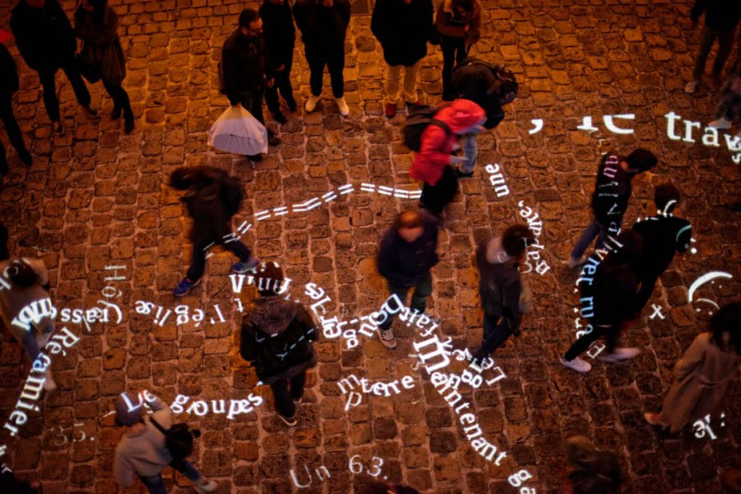 -->

<!-- http://bredechas2017.blogspot.com/2017/04/170428-lml-georges-perec-ses-vies-mode.html -->
<!-- class: left, middle  -->
<!-- background-size: cover -->

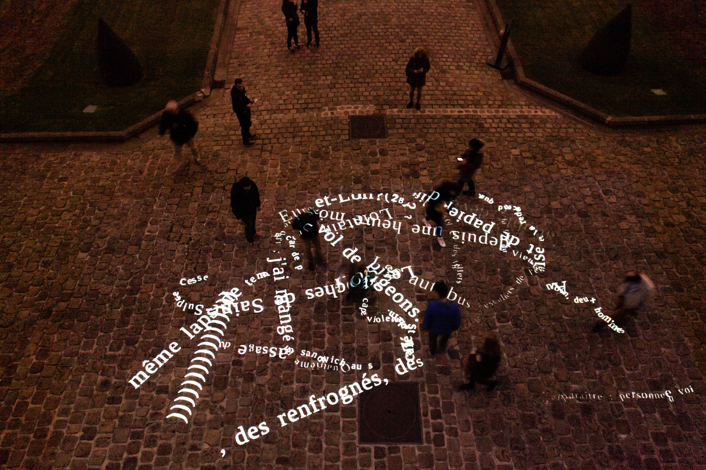

---
<video controls style='position: absolute;left: -60px;  top: 0px;'>
  <source src="img_interlignes/Interlignes.mp4" type="video/mp4">
</video>
---

## Tentative d'épuisement d'un lieu parisien (1975)
 
<table>

<td>
<tr>
En octobre 1974, Georges Perec s'installe 
place Saint-Sulpice (Paris 6ième). 
<tr/>
<tr>
<tr/>
<td/>
<table/>

Pendant trois jours d'affilée, il tente de prendre note de tout ce qu'il voit.

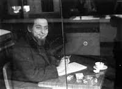
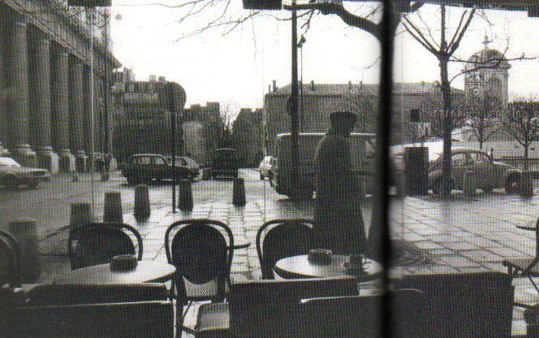

Il en établit ainsi une liste représentant la vie quotidienne, sa monotonie, mais aussi les variations infimes du temps, de la lumière, du décor, du vivant.

---
<i>
Esquisse d'un inventaire de quelques-unes des choses strictement visibles : 
 ...
 
 — Des slogans fugitifs : « De l' autobus , je regarde Paris » 
 — De la terre : du gravier tassé et du sable. 
 — De la pierre : la bordure des trottoirs, une fontaine , une église , des maisons... 
 — De l'asphalte 
 — Des arbres ( feuilles, souvent jaunissants ) 
 — Un morceau assez grand de ciel (peut-être 1/6e de mon champ visuel) 
 — Une nuée de pigeons qui s'abat soudain sur le terre-plein central, entre l'église et la fontaine 
 — Des véhicules (leur inventaire reste à faire) 
 — Des êtres humains 
 — Une espèce de basset 
 — Un pain (baguette) 
 — Une salade (frisée ?) débordant partiellement d'un cabas 
 
 Trajectoires: 
 Le 96 va à la gare Montparnasse 
 Le 84 va à la porte de Champerret 
 Le 70 va Place du Dr Hayem , Maison de 
 l'O.R.T.F. 
 Le 86 va à Saint-Germain-desPrés 
 Exigez le Roquefort Société le vrai dans son ovale vert 
 ...
</i>

---
# 2017 : débuts du projet
- mai : écriture d'un dossier de candidature pour Nuit Blanche Paris 2017
- fin juin : le projet est accepté !
- mi-septembre : 
  - développement logiciel
  - contruction de la structure métalique
  - premiers tests et ajustements
- 7 octobre : première diffusion aux Archives Nationales avec 5000 spectateurs

<!-- 
# Plan
- s'installer
- observer les mouvements
- mettre en lumière le texte -->

---
# Intentions de l'installation
- occuper un espace public qui reflète le texte (auto-référence)
- créer une analogie entre marche et écriture
- faire vivre une expérience de lecture aux passants
  - lecture directement sur le sol
  - le texte de révèle sous les pas des spectateurs
- mettre en lumière nos trajectoires
- la technique est un moyen, pas un but

<!-- dispositif vidéo déployé dans un espace urbain -->

 
<!-- - caméra infrarouge  - vidéo-projecteur (5000 lumens) -->

---
class:center, middle
# Fonctionnement du dispositif vidéo

---
# Dispositif vidéo

<!-- 

 -->

- capteur infrarouge placé en hauteur
- algorithme d'analyse de mouvements
- cheminements des passants associées à des zones de texte
- projection mapping au sol avec un vidéo-projecteur

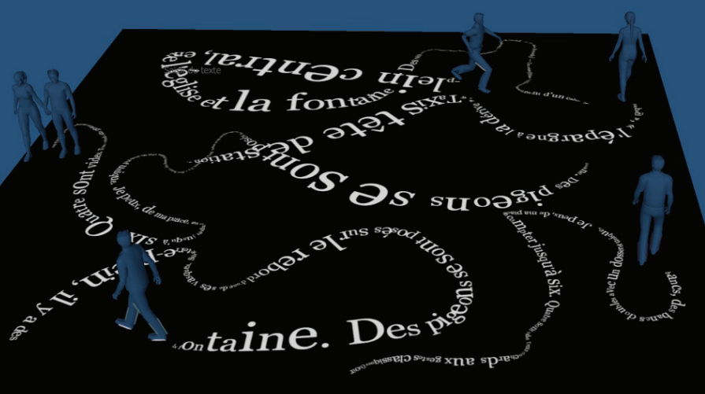
--- 

Dispositif physique reposant sur une structure
- placement en hauteur (8m -> image : l=8m, L=12m)
- angle de prise de vue et de projection en plongée
- déport au dessus du public

---

# Structure métalique autoportée (v1)
.column[
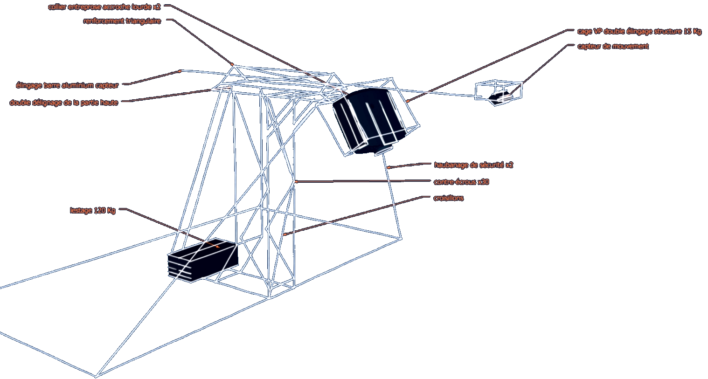
]

.right[
       
- soudée sur mesure
- poids = 30kg
- lestage = 120kg
- temps de montage : 2h
- homologuée par le bureau ICE

]
---
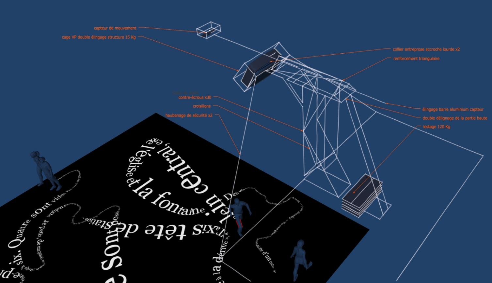

---
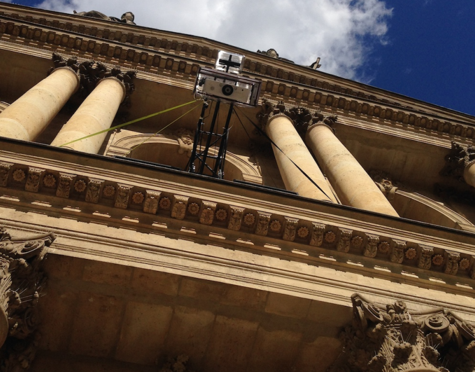

---
class: split-40
## Simplification du dispositf de projection (v2)
.column[
  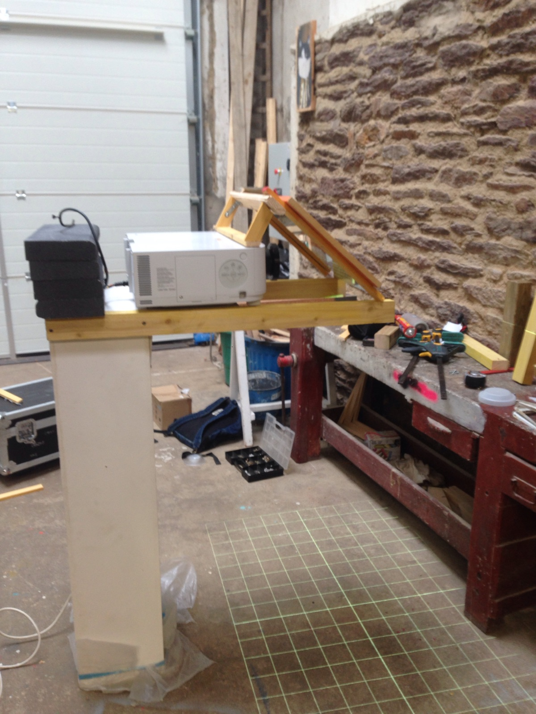
]
.column[
   
- projecteur posé a plat 
- miroir à 45° devant l'objectif
- structure placée derrière une fenêtre
- amélioration de la sécurité
- simplification du déploiement
]
---

## Captation v1 : Kinect + Libfreenect2
- kernel density estimation : captation à 15m au lieu de 5m :)
- détection simultanée et complémentaire des flux 3d et IR
.center[
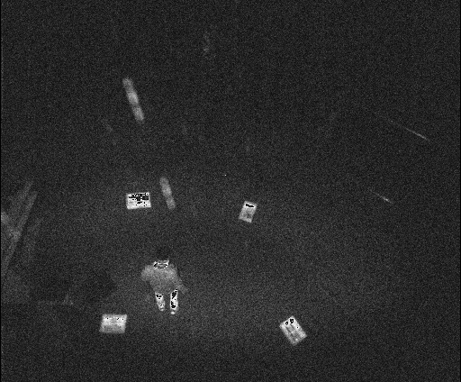
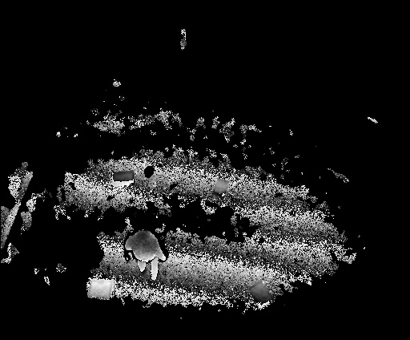
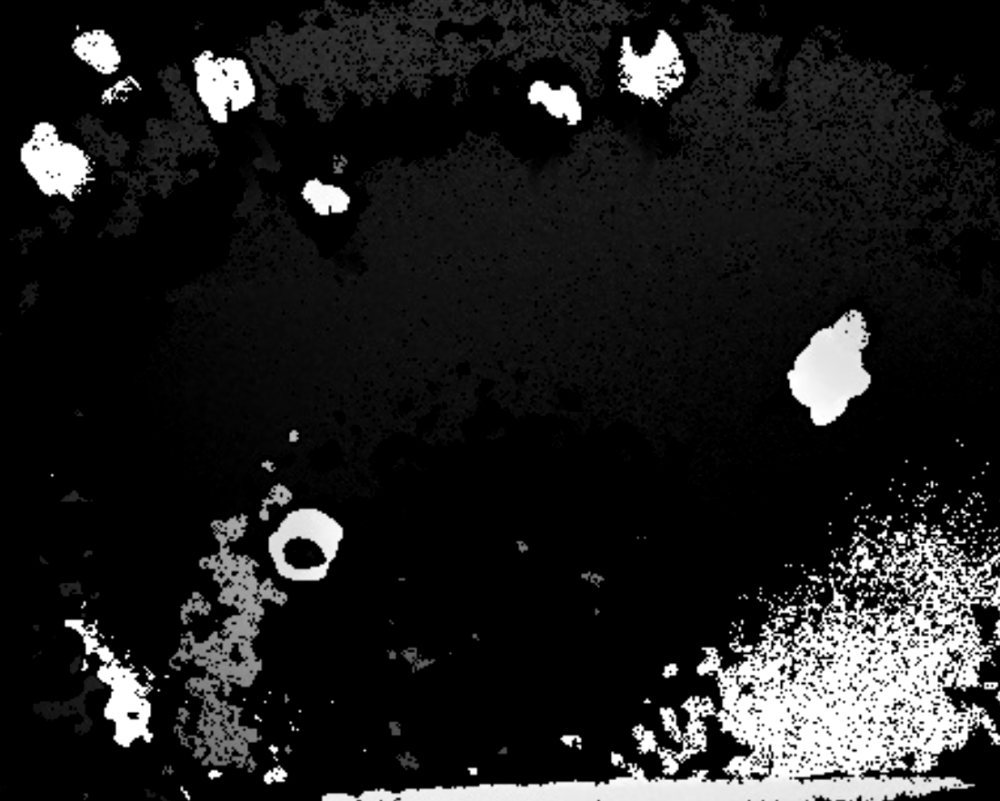
]
limitations
- bruit généré par le capteur
- conditions atmosphériques (pluie)
- USB : ralonge 5m max

<!-- - résolution (640 x 480) -->
<!-- 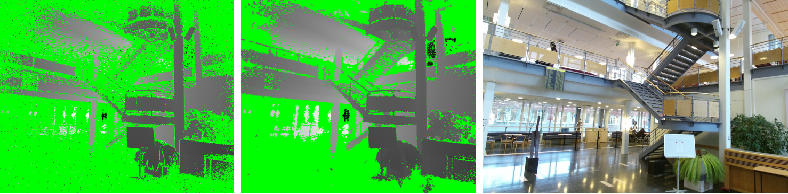 -->

[Efficient Multi-Frequency Phase Unwrapping using Kernel Density Estimation (Järemo Lawin et al. 2016)](https://arxiv.org/abs/1608.05209)

---
class: split-40
<!-- - caméra vidéosurveillance wifi : Rapberry-PI + module caméra infrarouge -->
### Captation v2 : Rapberry caméra IR + projecteur IR
.column[
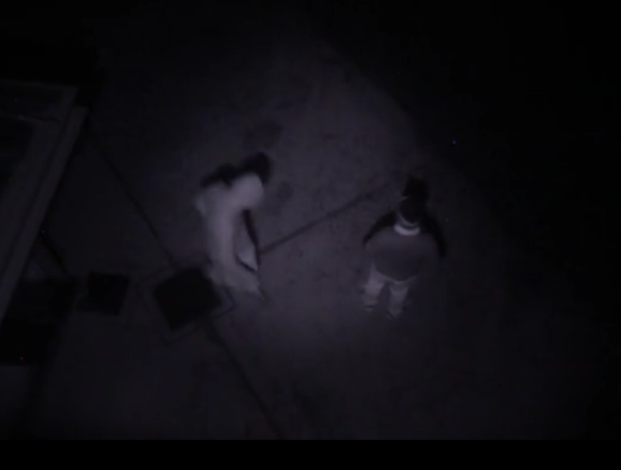
]
.column[
   
- image de meilleure qualité
- éclairage avec plusieurs projecteurs IR
- filtre lumière visible (< 780nm)
    - flux parasites et texte projeté
- hauteur plus importante (> 15m) 
    - surface d'interaction étendue
    - déport caméra facultatif
- WiFi ou ethernet
]

---
class:center, middle
# Cartographier les trajectoires en temps réel 

---
class: split-40
# Détection et tracking du public
.column[
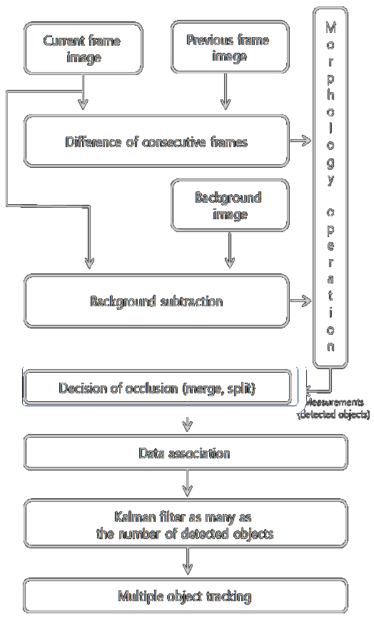
]
.column[
    
prétraitements
  - background substraction
  - détection de formes

 

tracking vidéo
  * analyse prédictive du déplacement
  * identification des objets 
]
---
## Background substraction 
<table>
<tbody>
<tr>
<td>image courante</td>
<td>- référence</td>
<td> = objets</td>
</tr>
<tr>
<td></td>
<td>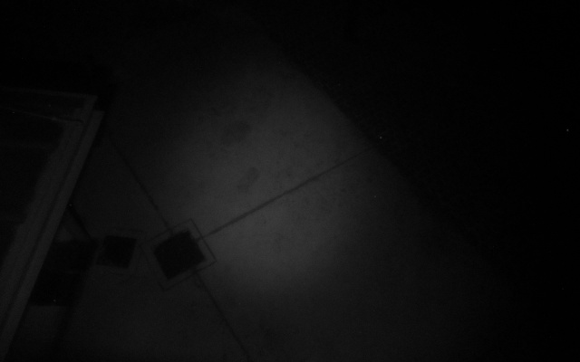</td>
<td>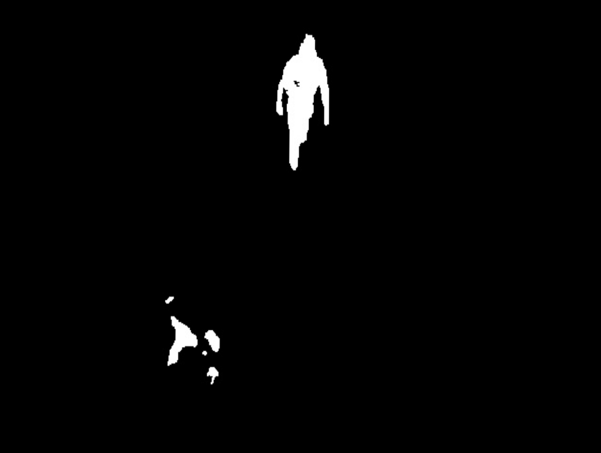</td>
</tr>
</tbody>
</table>

- estimation d'une "image" de référence = scène vide
- "soustraction" avec image courante
- mise en évidence de formes à détecter
  

<!-- - améliorations en condition de pluie et de luminosité changeante -->
<!-- ### background substraction V2 -->

---
name: preprocessing

---

## Détection de blobs
- binarisation de l'image soustraite par amplification du contraste
- recherche des contours des formes
- fusion de blobs contigus avec filtres morphologiques : 
  - érosion des pixels isolés
  - dilatation des formes contigues
- calcul des *bounding boxes* enveloppant ces formes

Comment analyser l'évolution de ces formes au cours du temps ?

 <!-- pour les associer à des trajectoires
Comment determiner qu'une forme aun temps t=i est la même à t=i+1 ? -->

---
## Tracking d'objets disincts en temps réél
[Simple online and realtime tracking (Bewley et al., 2016)](http://arxiv.org/abs/1602.00763)

Un objet détecté est associé à un état $x = [u, v, s, r, u', v', s']$
  - $u,v$ : position du centre de la *Bounding Box*
  - $s$ et $r$ : aire et ratio de la BB
  - $u', v', s'$ prédictions de la position et aire suivante

Filtre de Kalman : estimation de trajectoires candidates
  - prédiction : estimation de l'état courant avec l'état estimé précédemment
  - mise à jour : correction de l'état prédit avec observation courante

Algorithme hongrois : couplage optimal entre prédictions et observations

<!-- ---
## Tracking dans des séries bruitées et incomplètes

- mise à jour de l'état courant avec
  - objet nouvellement détecté si proche de la prédiction
  - objet prédit si pas d'association satisfaisante (bruit) -->

<!-- Faible coût calculatoire (25 FPS) vs algo deep learning (tiny yolo v3 : 2 FPS) -->

<!-- - paramètres de vitesse résolus par le filtre de Kalman -->
<!-- 
- In assigning detections to existing targets, each target’s
bounding box geometry is estimated by predicting its new
location in the current frame.
- The assignment cost matrix is
then computed as the intersection-over-union (IOU) distance
 between each detection and all predicted bounding boxes
from the existing targets
- assignment is solved optimally
using the Hungarian algorithm. 
- Additionally, a minimum
IOU is imposed to reject assignments where the detection to
target overlap is less than IOUmin.
- When objects enter and leave the image, unique identities
need to be created or destroyed accordingly. 
- For creating
trackers, we consider any detection with an overlap less than
IOUmin to signify the existence of an untracked object. 
- The
tracker is initialised using the geometry of the bounding box
with the velocity set to zero. 
- Since the velocity is unobserved
- at this point the covariance of the velocity component is ini-ntitsed with large values, reflecting this uncertainty. 
- Addi-tionally, the new tracker then undergoes a probationary period where the target needs to be associated with detections to
accumulate enough evidence in order to prevent tracking of
false positives.
- Tracks are terminated if they are not detected for TLost
frames. 

Lien vidéo YouTube ?
- 10x plus rapide que les autres algos de tracking (250hz) -->

<!-- - si erreur de détection, 
- librairie FilterPy -->
<!-- ### Algorithme des K plus proches voisins 
- ré-identifier les corps qui ont disparu du champ de la caméra

Un algorithme de machine learning analyse chaque corps en mouvement pour identifier une trajectoire qui deviendra une zone d’apparition du texte. -->

---
class: center, middle
# Interaction avec le public

---
# Conditions pour jouer en public
- faible luminosité (nuit ou pénombre) pour rendre le texte lisible
- espace au sol limité par une zone rectangulaire (12m x 8m minimum)
- une vingtaine de personnes peuvent interagir simultanément 
- une centaine peuvent circuler autour de la zone

---
### Contrôle de l'application
Paramètres liés à la captation
.column[

]
.column[
- contraste, luminosité caméra
- choix algo de détection (BG substraction)
- morphologie
- nombre limite de blobs pour faire apparaitre/disparaitre une trajectoire
- distance max entre blob candidat et prédiction
]

---
### Contrôle de l'application
Paramètres typographiques
.column[
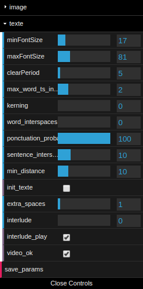
]
.column[
- taille (min/max) du texte
- influence vélocité
- espacement entre mots et lettres (kerning)
- insertion de ponctuation pour limiter la taille du texte
- déclanchement d'interludes video
]

---
# Génération du texte
Application Web
- trajectoires transmises via websockets
- corpus découpé en énoncés
- chaque marcheur "consomme" le texte au fur et à mesure
- taille du texte est fonction de l accélération
- orientation du texte adapté a la trajectoire
- interludes vidéo projetées entres les chapitres

<!-- HTML, CSS, JS
- tracés typographiques : canvas avec javascript  
- communication websockets (coordonnées de déplacement)
- module de mapping en CSS --> 

---
# Projection mapping
Comment le texte aparaît-il sous les pas des marcheurs ?

Outil de pour faire correspondre projection et captation
  - propriétés CSS pour inscrire un canvas sur un quad 3d dont on peut changer la forme
  - synchronisation des coordonnées source/cible a travers le localstorage du navigateur

---
# Conclusion et perspectives

- Interlignes invite à découvrir la lecture d'un texte dans l'espace public
  - partage d'une experience sensible
- mise en lumière d'un texte de Georges Perec
  - sigularité des situations infra-ordinaires
  - auto-référence : lire dans la rue un texte qui parle de la rue

---
Réalisation technique
- version initiale réalisée en 3 semaines
- detourne des techniques de vidéo-surveillance : 
  - captation, détection et tracking de foule dans l'espace public
- techniques issues du web au service d'une "expérience spectateur"

---
class:center, middle
## Travaux en cours et perspectives
---
## написанное между строк
Prochain temps fort : Saint-Petersbourg, septembre 2019
- Bibliothèque Nationale : corpus des des Marginalia de Voltaire
- Medialab Alexandrinsky : organisation et animation d'un workshop
.center[
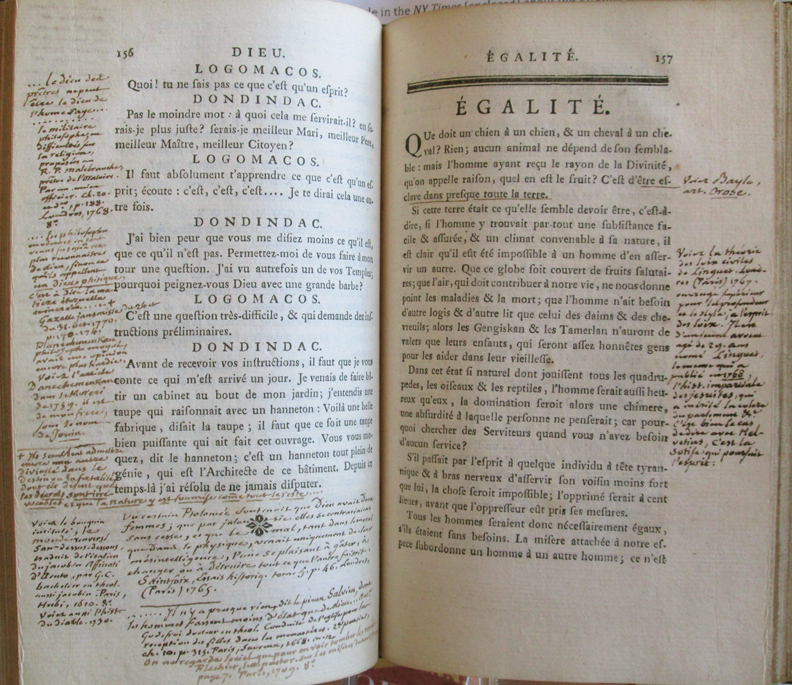
  ]
---
### Enrichissement du corpus
- ouverture du texte au public
  - ateliers d'écriture en milieu scolaire
  - api pour collecter les contributions : sms, réseaux sociaux ?

---
### Amélioration de la captation
- optimiser l'utilisation de projecteurs infrarouge
- amélioration du filtrage de la lumière visible
- mutli-caméras et multi-projecteurs :
  - déploiement du dispositif sur toute une rue

---
class: split-40
### Amélioration de la détection
.column[

]
.column[
   
deep learning sur architecture mobile :  
- mobilenet, posenet, bodypix
  
génération jeu de données spécifique avec l'algo de détection actuel
]
---
### Amélioration du rendu et de l'interaction
- moteur physique pour le rendu du texte
- rendre le texte plus lisible quand le contenu est abondant
  - effets typographiques : envolées et disparition sélectives des lettres/mots
  - repositionner légèrement les lignes les unes par rapport aux autres
  - couleurs ?
- inviter a interagir lorsque l'espace est vide (interludes vidéo ?)

---
### Simplification du déploiement materiel
- déploiement et exploitation possible pour un non expert
- réduction du temps de montage
- utilisation de projecteurs plus puissants pour une plus grande surface d'interaction
- portage de l'application de détection sur Raspberry Pi ou smartphone Android équipé d'un caméra infrarouge

---
### Projection mapping automatique par spatial scanning 
- projection/captation de patterns pour la calibration automatique de la géométrie du mapping
- réduire le temps de calibration caméra-projecteur
- confier le déploiement à un non spécialiste 

---
class: left, middle

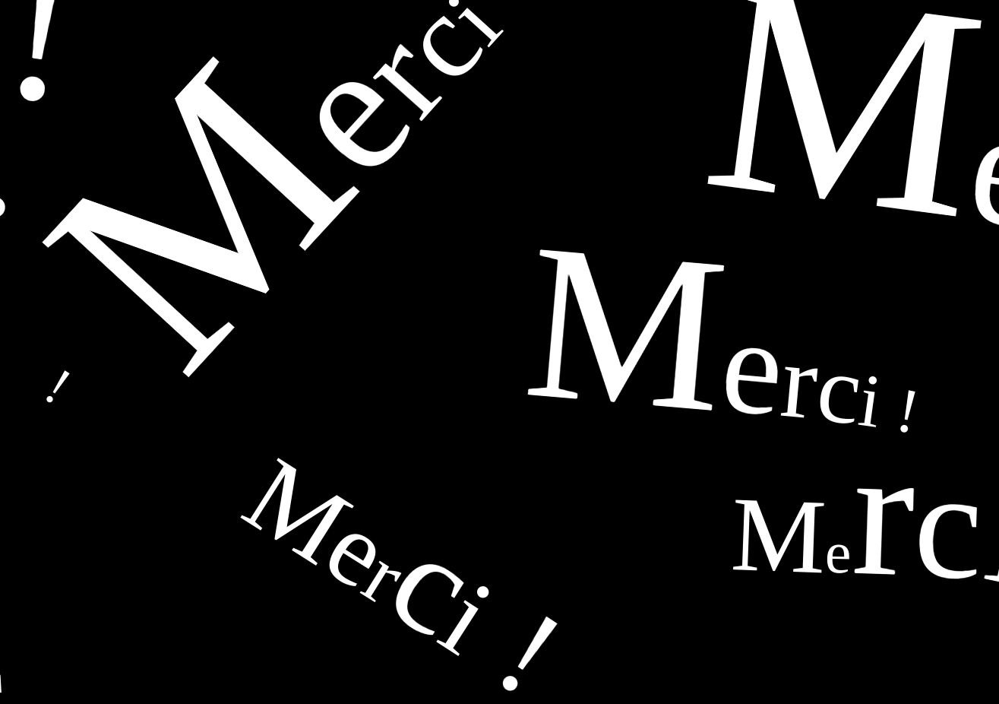

<!-- ## Architecture logicielle
### Technos utilisées :
Backend : Python
- serveur Web : sanic (libuv)
- OpenCV 4 : prétraitement de l'image 
- machine learning : FilterPy, Scikit-Learn

Front-end :  --> 

<!-- 
Cette détection identifie chaque corps comme une zone d’apparition du texte dont l’orientation s’adapte dynamiquement aux trajectoires. Les textes parcourus seront alors projetés directement sur le sol où les spectateurs pourront voir les mots apparaître et disparaître sous leurs pas. -->