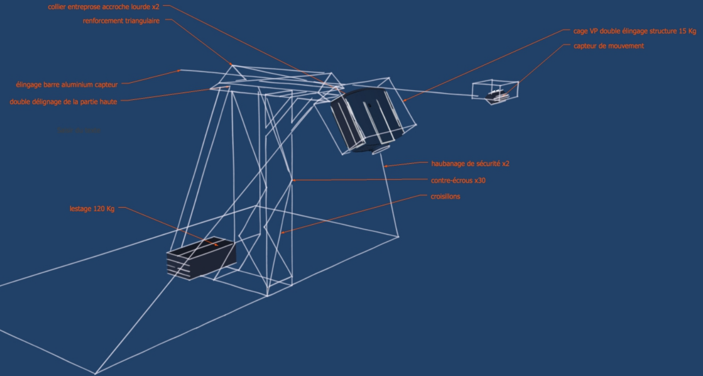

<!-- class: center, middle -->
# Interlignes
##Installation vidéo participative
 
Thomas Girault thomas@girault.fr
 
Mitch Fournial mitch@lasophiste.com
   
http://www.lasophiste.com/portfolio/interlignes/
 
https://github.com/thomasgirault/interlignes
---
class: center, middle

<!-- http://bredechas2017.blogspot.com/2017/04/170428-lml-georges-perec-ses-vies-mode.html -->

---

class: middle, center
<iframe width="100%" height="100%" src="https://www.youtube.com/embed/YD09Kl0sIQc" frameborder="0" allow="encrypted-media" allowfullscreen></iframe>

---
## Tentative d'épuisement d'un lieu parisien (1975)
En octobre 1974, Georges Perec s'installe place Saint-Sulpice (Paris 6ième). 

Pendant trois jours d'affilée, il tente de prendre note de tout ce qu'il voit.

Il en établit ainsi une liste représentant la vie quotidienne, sa monotonie, mais aussi les variations infimes du temps, de la lumière, du décor, du vivant.

---
<i>
Esquisse d'un inventaire de quelques-unes des choses strictement visibles : 
 ...
 
 — Des slogans fugitifs : « De l' autobus , je regarde Paris » 
 — De la terre : du gravier tassé et du sable. 
 — De la pierre : la bordure des trottoirs, une fontaine , une église , des maisons... 
 — De l'asphalte 
 — Des arbres ( feuilles, souvent jaunissants ) 
 — Un morceau assez grand de ciel (peut-être 1/6e de mon champ visuel) 
 — Une nuée de pigeons qui s'abat soudain sur le terre-plein central, entre l'église et la fontaine 
 — Des véhicules (leur inventaire reste à faire) 
 — Des êtres humains 
 — Une espèce de basset 
 — Un pain (baguette) 
 — Une salade (frisée ?) débordant partiellement d'un cabas 
 
 Trajectoires: 
 Le 96 va à la gare Montparnasse 
 Le 84 va à la porte de Champerret 
 Le 70 va Place du Dr Hayem , Maison de 
 l'O.R.T.F. 
 Le 86 va à Saint-Germain-desPrés 
 Exigez le Roquefort Société le vrai dans son ovale vert 
 ...
</i>

---
## De Perec à Interlignes
- mai 2017 : écriture du projet pour l'appel à projet Nuit Blanche Paris 2017
- fin juin : le projet est accepté !
- mi-septembre 2017 : développement logiciel et contruction du dispositif materiel  
- fin-septembre 2017 : premiers test et ajustements
- 7 octobre 2017 : première diffusion aux Archives Nationales

---
# Plan
- s'installer
- observer les mouvements
- mettre en lumière le texte
---
## Installation vidéo
prend place dans un 
- espace urbain délimité par une zone rectangulaire
- régie par un dispositif vidéo
- caméra infrarouge + vidéoprojecteur
- 

---
## Problématiques
-  angle de prise de vue de de projection en plongée

--- 

# Dispositif physique

Contraintes :
- angle de prise de vue et de projection en plongée
- déport de la captation et projection au dessus du public
- placement en hauteur (8m -> image : l=8m, L=10m)

---

## V1
structure autoportée démontable
- soudée sur mesure (Nicolas Gau)
- poids = 30kg
- lestage = 120kg
- temps de montage : 2h
- certification sécurité

---

---

---

---
## V2 : simplifications
- projecteur posé a plat
- miroir à ~45° devant l'objectif
- possibilité de projeter derrière une fenêtre
- amélioration de la sécurité et du déploiement
  - le VP peut être placé sur une simple table derrière une fenêtre

---

---
# Dispositif vidéo
### V1 : caméra Kinect
Libfreenect2 avec Kernel Density Estimation (captation à 15m au lieu de 5m)

Complémentarité des flux 3d et infrarouge

[https://arxiv.org/abs/1608.05209](Efficient Multi-Frequency Phase Unwrapping using Kernel Density Estimation (Järemo Lawin et al. 2016))

---
### V2 : caméra + projecteur infrarouges
  - Rapberry-PI + module caméra IR 
  - filtre la lumière visible (< 780nm)
  - projecteurs IR pour éclairer la zone de captation 
  - la caméra peut être placée a une hauteur beaucoup plus importante (> 15m)

---
class: top, left
### Remote control

- simple page web pour contrôler les paramètres de l'application
- paramètres liés à la captation
- ou a la typographie

---
# Détection et tracking du public
## cartographier des déplacements en temps réel  

## prétraitements de l'image 

background substraction V1
- image de référence : scène vide
- soustraction avec image courante
- la différence fait apparaître des objets inexistants

background substraction V2
- historique des pixels calculée dynamiquement
- remplace l'image de référence
- améliorations en condition de pluie et de luminosité changeante

Faible coût calculatoire par rapport a des techniques de deep learning

---
name: preprocessing
class: center, middle
#

---

## Détection de blobs
- binarisation de l'image soustraite à l'aide de seuils
- recherche des contours des formes
- calcul des *bounding boxes* enveloppant ces formes

Comment determiner qu'une forme à t=i est la même à t=i+1 ?

---
## Algorithme de tracking
Realtime multiple object tracking (MOT)

---
## Algorithme SORT
Chaque cible (bounding box) est représentée par un état

x = [u, v, s, r, u', v', s']
T
- u et v : position du centre
- s et r : aire et ratio

- mise a jour la cible avec la détection qui lui est associée
- paramètres de vitesse résolus par le filtre de Kalman
- cible prédite si pas d association satisfaisante

- In assigning detections to existing targets, each target’s
bounding box geometry is estimated by predicting its new
location in the current frame.
- The assignment cost matrix is
then computed as the intersection-over-union (IOU) distance
 between each detection and all predicted bounding boxes
from the existing targets
- assignment is solved optimally
using the Hungarian algorithm. 
- Additionally, a minimum
IOU is imposed to reject assignments where the detection to
target overlap is less than IOUmin.
- When objects enter and leave the image, unique identities
need to be created or destroyed accordingly. 
- For creating
trackers, we consider any detection with an overlap less than
IOUmin to signify the existence of an untracked object. 
- The
tracker is initialised using the geometry of the bounding box
with the velocity set to zero. 
- Since the velocity is unobserved
- at this point the covariance of the velocity component is ini-ntitsed with large values, reflecting this uncertainty. 
- Addi-tionally, the new tracker then undergoes a probationary period where the target needs to be associated with detections to
accumulate enough evidence in order to prevent tracking of
false positives.
- Tracks are terminated if they are not detected for TLost
frames. 

Lien vidéo YouTube ?
- 10x plus rapide que les autres algos de tracking (250hz)

[http://arxiv.org/abs/1602.00763](Simple online and realtime tracking (Bewley et al., 2016))

## Filtres de Kalman
Utilisé pour l approximation et la prédiction de trajectoire
- librairie FilterPy

## Algorithme hongrois

Pour chaque nouvelle image on regarde quel filtre prédit le mieux la position de chaque blob candidat

- algorithme d'optimisation combinatoire
- résout le problème d'affectation en temps polynomial
- trouve un couplage parfait de poids maximum dans un graphe biparti dont les arêtes sont valuées

### Algorithme des K plus proches voisins 
- ré-identifier les corps qui ont disparu du champ de la caméra

Un algorithme de machine learning analyse chaque corps en mouvement pour identifier une trajectoire qui deviendra une zone d’apparition du texte.

---
# Génération du texte
- Utilisation des zones identifiées comme des corps en mouvement
- zones d'appartition du texte
- la taille du texte est fonction de l accélération
- l'orientation du texte s adapté au chemin choisi

---
# Projection mapping
- pour faire apparaitre le texte sous les pas des marcheurs
- besoin de faire correspondre la zone de projection et celle de captation
- propriétés CSS pour inscrire un canvas sur un quad 3d dont on peut changer la forme
- synchronisation des coordonnées source/cible a travers le localstorage du navigateur

Demo

---
# Perspectives

---
## Simplification et optimisation
- packaging
- portage de l'application de détection sur Raspberry Pi
- portage sur smartphone équipé d'un caméra infrarouge

---
## Mutli-caméras et multi-projection
- déployer le dispositif sur toute une rue

---

---

# Mapping automatique
    - le temps de calibration caméra-projecteur est critique
    - techniques de spatial scanning : adaptation de la géométrie projection de patterns (échiquier) sur la zone de captation
---
# Déploiement physique
  - réduction du temps de montage
  - utilisation d'autres projecteurs
---
# Amélioration de la captation
  - optimiser l'utilisation de projecteurs infrarouge
  - filtrage de la lumière visible

---
# La Sophiste

---
## Architecture logicielle
### Technos utilisées :
Backend : Python
- serveur Web : sanic (libuv)
- OpenCV 4 : prétraitement de l'image 
- machine learning : FilterPy, Scikit-Learn

Front-end : HTML, CSS, JS
- tracés typographiques : canvas avec javascript  
- communication websockets (coordonnées de déplacement)
- module de mapping en CSS

<!-- 
Cette détection identifie chaque corps comme une zone d’apparition du texte dont l’orientation s’adapte dynamiquement aux trajectoires. Les textes parcourus seront alors projetés directement sur le sol où les spectateurs pourront voir les mots apparaître et disparaître sous leurs pas. -->