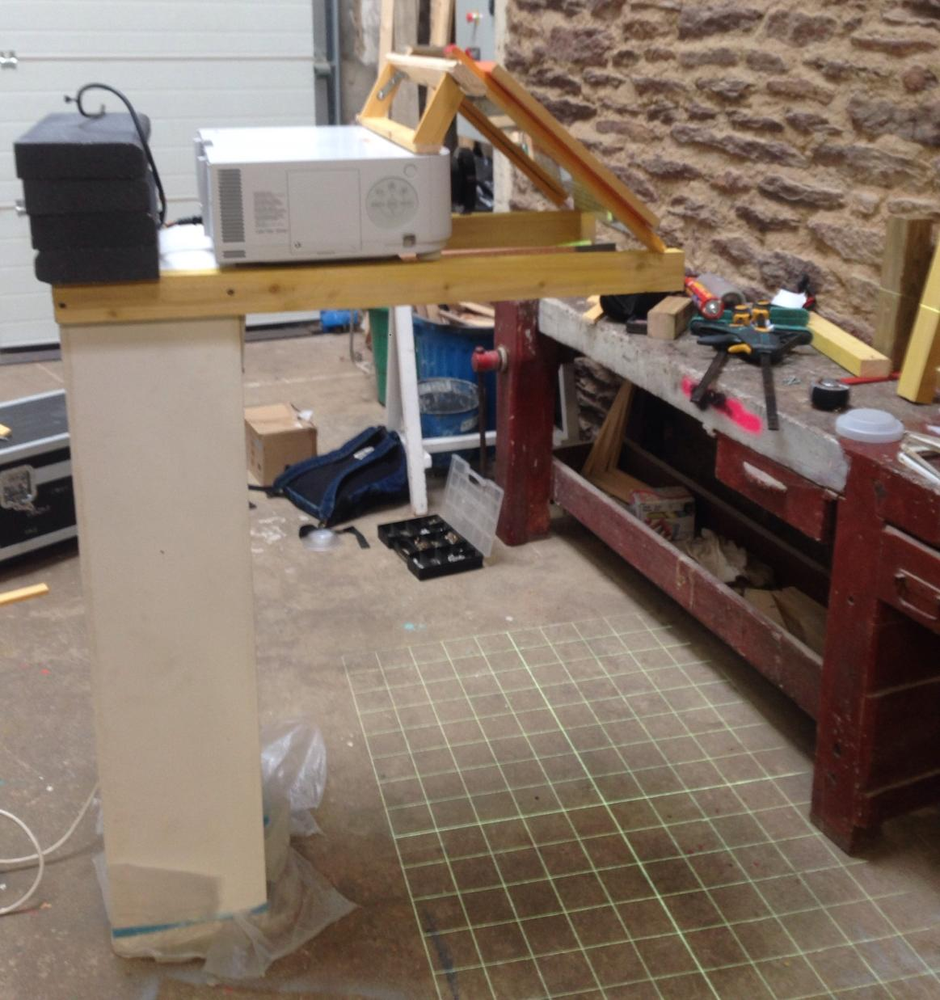

<!-- class: center, middle -->
# Interlignes
##Installation vidéo participative
 
Thomas Girault thomas@girault.fr
 
Mitch Fournial mitch@lasophiste.com
   
http://www.lasophiste.com/portfolio/interlignes/
 
https://github.com/thomasgirault/interlignes
---
<!-- class: center, middle -->

<!-- http://bredechas2017.blogspot.com/2017/04/170428-lml-georges-perec-ses-vies-mode.html -->
<!-- class: left, middle  -->
<!-- background-size: cover -->

---

---

class: middle, center
<iframe width="100%" height="100%" src="https://www.youtube.com/embed/YD09Kl0sIQc" frameborder="0" allow="encrypted-media" allowfullscreen></iframe>

---
## Tentative d'épuisement d'un lieu parisien (1975)
 
<table>

<td>
<tr>
En octobre 1974, Georges Perec s'installe 
place Saint-Sulpice (Paris 6ième). 
<tr/>
<tr>
<tr/>
<td/>
<table/>

Pendant trois jours d'affilée, il tente de prendre note de tout ce qu'il voit.

Il en établit ainsi une liste représentant la vie quotidienne, sa monotonie, mais aussi les variations infimes du temps, de la lumière, du décor, du vivant.

---
<i>
Esquisse d'un inventaire de quelques-unes des choses strictement visibles : 
 ...
 
 — Des slogans fugitifs : « De l' autobus , je regarde Paris » 
 — De la terre : du gravier tassé et du sable. 
 — De la pierre : la bordure des trottoirs, une fontaine , une église , des maisons... 
 — De l'asphalte 
 — Des arbres ( feuilles, souvent jaunissants ) 
 — Un morceau assez grand de ciel (peut-être 1/6e de mon champ visuel) 
 — Une nuée de pigeons qui s'abat soudain sur le terre-plein central, entre l'église et la fontaine 
 — Des véhicules (leur inventaire reste à faire) 
 — Des êtres humains 
 — Une espèce de basset 
 — Un pain (baguette) 
 — Une salade (frisée ?) débordant partiellement d'un cabas 
 
 Trajectoires: 
 Le 96 va à la gare Montparnasse 
 Le 84 va à la porte de Champerret 
 Le 70 va Place du Dr Hayem , Maison de 
 l'O.R.T.F. 
 Le 86 va à Saint-Germain-desPrés 
 Exigez le Roquefort Société le vrai dans son ovale vert 
 ...
</i>

---
# 2017 : débuts du projet
- mai : écriture d'un dossier de candidature pour Nuit Blanche Paris 2017
- fin juin : le projet est accepté !
- mi-septembre : 
  - développement logiciel
  - contruction de la structure métalique
  - premiers tests et ajustements
- 7 octobre : première diffusion aux Archives Nationales avec 5000 spectateurs

<!-- 
# Plan
- s'installer
- observer les mouvements
- mettre en lumière le texte -->

---
# Intentions de l'installation
- occuper un espace public qui reflète le texte (auto-référence)
- créer une analogie entre marche et écriture
- faire vivre une expérience de lecture aux passants
  - lecture directement sur le sol
  - le texte de révèle sous les pas des spectateurs
- mettre en lumière nos trajectoires
- la technique est un moyen, pas un but

<!-- dispositif vidéo déployé dans un espace urbain -->

---
# Conditions pour jouer en public

Dispositif physique reposant sur une structure
- placement en hauteur (8m -> image : l=8m, L=12m)
- angle de prise de vue et de projection en plongée
- déport au dessus du public

Interaction du public
- faible luminosité (nuit ou pénombre) pour rendre le texte lisible
- espace au sol limité par une zone rectangulaire (12m x 8m minimum)
- une vingtaine de personnes peuvent interagir simultanément 
- une centaine peuvent circuler autour de la zone
 
<!-- - caméra infrarouge  - vidéo-projecteur (5000 lumens) -->

---
# Fonctionnement du dispositif vidéo

<!-- 

 -->

- captation par un capteur infrarouge placé en hauteur
- algorithme d'analyse des mouvements
- cheminements des passants associées à des zones de texte
- projection au sol avec un vidéo-projecteur
- mapping pour faire correspondre les trajectoires captées aux cheminements réels

--- 

---
## Structure métalique autoportée (v1)

- soudée sur mesure
- poids = 30kg
- lestage = 120kg
- temps de montage : 2h
- homologuée par le bureau ICE

---

---

---
class: split-40
## Simplification du dispositf de projection (v2)
.column[
- projecteur posé a plat avec un miroir à ~45° devant l'objectif
- amélioration de la sécurité et du déploiement
  - le VP peut être placé sur une simple table derrière une fenêtre
]
.column[
  
]
---

---
# Dispositif vidéo
### V1 : caméra Kinect
Libfreenect2
- Kernel Density Estimation : hack pour capter à 15m au lieu de 5m :)
- détection simultanée et complémentaire des flux 3d et infrarouges

limitations
- conditions atmosphériques (bruit généré par la pluie)
- résolution (640 x 480)
- transfert USB : ralonge 5m max

[https://arxiv.org/abs/1608.05209](Efficient Multi-Frequency Phase Unwrapping using Kernel Density Estimation (Järemo Lawin et al. 2016))

---
### V2 : caméra IR + projecteur IR
- Caméra vidéosurveillance wifi : Rapberry-PI + module caméra infrarouge … meilleur contraste et résolution
- filtrage la lumière visible (< 780nm) pour limiter les flux parasites et le texte projeté
- placement possible a une hauteur beaucoup plus importante (> 15m), une surface d'interaction étendue sans utilisation d'une perche
- multiple projecteurs IR pour éclairer plus précisément la zone de captation

---
class: top, left
### Controle de l'application

Simple page web pour piloter l'API rest depuis un smartphone (dat.gui) au milieu du public

#### paramètres liés à la captation
- contraste, luminosité caméra
- choix algo de détection (BG substraction)
- morphologie
- nombre limite de blobs pour faire apparaitre/disparaitre une trajectoire
- distance max entre blob candidat et prédiction

### paramètres typographiques
- taille (min/max) du texte
- influence vélocité
- espacement entre mots et lettres (kerning)
- insertion de ponctuation pour limiter la taille du texte
- déclanchement d'interludes video

---
# Détection et tracking du public
## cartographier des déplacements en temps réel  

## prétraitements de l'image 

### background substraction V1
- image de référence : scène vide
- soustraction avec image courante pour mettre en évidence les objets en déplacement

### background substraction V2
- historique des pixels calculée dynamiquement
- remplace l'image de référence
- améliorations en condition de pluie et de luminosité changeante

Faible coût calculatoire (50hz) vs algo deep learning (tiny yolov3 : 2hz)

---
name: preprocessing
class: center, middle
#

---

## Détection de blobs
- binarisation de l'image soustraite par amplification du contraste
- recherche des contours des formes
- filtres morphologiques : suppression des pixels isolés et amplification des autres formes pour fusionner les blobs contigus
- calcul des *bounding boxes* enveloppant ces formes

On doit maintenant analyser l'évolution de ces formes au cours du temps pour les associer à des trajectoires

---
## Algorithme de tracking
Comment determiner qu'une forme à t=i est la même à t=i+1 ?

Realtime multiple object tracking (MOT)

---
## Algorithme SORT
Chaque cible (bounding box) est représentée par un état

x = [u, v, s, r, u', v', s']
T
- u et v : position du centre
- s et r : aire et ratio

- mise a jour la cible avec la détection qui lui est associée
- paramètres de vitesse résolus par le filtre de Kalman
- cible prédite si pas d'association satisfaisante (erreurs de détection)

- In assigning detections to existing targets, each target’s
bounding box geometry is estimated by predicting its new
location in the current frame.
- The assignment cost matrix is
then computed as the intersection-over-union (IOU) distance
 between each detection and all predicted bounding boxes
from the existing targets
- assignment is solved optimally
using the Hungarian algorithm. 
- Additionally, a minimum
IOU is imposed to reject assignments where the detection to
target overlap is less than IOUmin.
- When objects enter and leave the image, unique identities
need to be created or destroyed accordingly. 
- For creating
trackers, we consider any detection with an overlap less than
IOUmin to signify the existence of an untracked object. 
- The
tracker is initialised using the geometry of the bounding box
with the velocity set to zero. 
- Since the velocity is unobserved
- at this point the covariance of the velocity component is ini-ntitsed with large values, reflecting this uncertainty. 
- Addi-tionally, the new tracker then undergoes a probationary period where the target needs to be associated with detections to
accumulate enough evidence in order to prevent tracking of
false positives.
- Tracks are terminated if they are not detected for TLost
frames. 

Lien vidéo YouTube ?
- 10x plus rapide que les autres algos de tracking (250hz)

[http://arxiv.org/abs/1602.00763](Simple online and realtime tracking (Bewley et al., 2016))

## Filtres de Kalman pour la prédiction de trajectoires
Utilisé pour l approximation et la prédiction de trajectoire

- si erreur de détection, 
- librairie FilterPy

## Algorithme hongrois
Pour chaque nouvelle image on recherche quel filtre prédit le mieux la position de chaque blob candidat

- algorithme d'optimisation combinatoire
- résout le problème d'affectation en temps polynomial
- trouve un couplage parfait de poids maximum dans un graphe biparti dont les arêtes sont valuées

### Algorithme des K plus proches voisins 
- ré-identifier les corps qui ont disparu du champ de la caméra

Un algorithme de machine learning analyse chaque corps en mouvement pour identifier une trajectoire qui deviendra une zone d’apparition du texte.

---
# Génération du texte
- les trajectoires calculées sont transmises a une appli web en websockets
- le corpus est découpé en énoncés qui seront "consommés" au fur et a mesure par chaque marcheur
- taille du texte est fonction de l accélération
- orientation du texte adapté a la trajectoire

A la fin d'un chapitre, une interlude vidéo est projetée

---
# Projection mapping

- besoin de faire correspondre la zone de projection et celle de captation
- pour faire apparaitre le texte sous les pas des marcheurs
- propriétés CSS pour inscrire un canvas sur un quad 3d dont on peut changer la forme
- synchronisation des coordonnées source/cible a travers le localstorage du navigateur

Demo

---
# Conclusion et perspectives

Interlignes : une pièce de art numérique qui invite a partager la lecture d'un texte dans l'espace public

- mise en lumière d'un texte de Georges Perec sur les situations infra-ordinaires du quotidien

- version initiale réalisée en 3 semaines
- detourne des techniques de vidéo-surveillance
- captation, détection et tracking de foule dans l'espace public
- techniques issues du web pour l' "expérience spectateur"
---

# Prochain temps fort
Saint-Petersbourg, septembre 2019
- Bibliothèque Nationale : représentation d'un texte de Voltaire
- Workshop au théâtre Alexandersky

---
## Simplifications du déploiement materiel
- déploiement et exploitation possible pour un non expert
- réduction du temps de montage
- utilisation de projecteurs plus puissants pour une plus grande surface d'interaction
- portage de l'application de détection sur Raspberry Pi ou smartphone Android équipé d'un caméra infrarouge

---
### Enrichissement du corpus
- développement d'une api pour capter les contributions au texte par le public
- sms, réseaux sociaux ?
- travail sur le texte avec d'autres auteurs (marginalias Voltaire, bibliothèque Nationale de Russie)

---

### Mapping automatique
objectifs : 
- réduire le temps de calibration caméra-projecteur critique
- confier le déploiement à un non spécialiste 

- spatial scanning : projection/captation de patterns pour la calibration automatique de la géométrie du mapping

---

---
### Amélioration de la captation
- optimiser l'utilisation de projecteurs infrarouge
- amélioration du filtrage de la lumière visible
- mutli-caméras et multi-projecteurs :
déploiement du dispositif sur toute une rue

### Amélioration de la détection
- deep learning sur architecture mobile ? mobilenet, posenet, bodypix
- nécessite un jeu de données spécifique a Interlignes : acquisition possible le avec l'algo de détection actuel

### Améliorations du rendu
- moteur physique pour le rendu du texte
- effets typographiques : envolées et disparition sélectives des lettres/mots
- rendre le texte plus lisible quand le contenu est abondant
- repositionner légèrement les lignes les unes par rapport aux autres
- couleurs ?
- inviter a interagir lorsque l'espace est vide (interludes vidéo ?)

---
# La Sophiste
Artisans bricoleurs de l irréel

---
## Architecture logicielle
### Technos utilisées :
Backend : Python
- serveur Web : sanic (libuv)
- OpenCV 4 : prétraitement de l'image 
- machine learning : FilterPy, Scikit-Learn

Front-end : HTML, CSS, JS
- tracés typographiques : canvas avec javascript  
- communication websockets (coordonnées de déplacement)
- module de mapping en CSS

<!-- 
Cette détection identifie chaque corps comme une zone d’apparition du texte dont l’orientation s’adapte dynamiquement aux trajectoires. Les textes parcourus seront alors projetés directement sur le sol où les spectateurs pourront voir les mots apparaître et disparaître sous leurs pas. -->